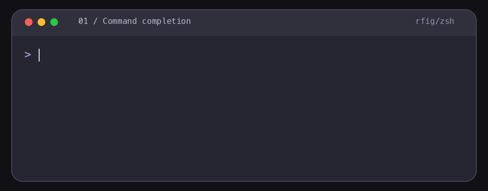

# rfig

[English](README.md) · **简体中文** · [官网](https://tamia6.github.io/rfig/zh/)

**在当前命令行中，同时获得补全菜单和历史命令自动建议。**

rfig 用 Rust 开发，为 zsh、Bash 和 Fish 提供输入时出现的候选菜单。用方向键选择、右箭头插入，再继续下一层补全；命令始终交给原 Shell 执行。

内置的历史命令自动建议（History-based Autosuggestions）以内联灰色文本显示，可替代 `zsh-autosuggestions` 类插件的历史命令自动建议功能，**无需另外安装命令自动建议插件**。菜单只根据实际输入生成，自动建议按当前工作目录匹配历史，两者可以同时显示。



演示包含命令与路径补全，以及输入 `gi` 时同时显示菜单和历史命令自动建议；`Ctrl+E` 接受建议，`Enter` 执行完整建议。

[安装](#安装) · [使用](#使用) · [Shell 支持](#shell-支持) · [补全来源](#补全来源与后台优化) · [测试验证](#测试验证)

> rfig v0.2.0 支持 macOS 和 Linux，以及 zsh、Bash 4.4+、Fish 3.6+。Homebrew 与二进制安装方式见下文。

## 功能列表

| 功能 | 当前能力 |
| --- | --- |
| 输入即显示菜单 | 输入、删除后触发更新，无需 `Tab`，没有人为防抖等待 |
| 多级动态补全 | 根据可用补全定义查询子命令、分支、路径等；层级与内容取决于来源 |
| 历史命令自动建议 | 按目录和输入前缀匹配历史，与菜单同时显示，可替代命令自动建议插件 |
| 使用习惯排序 | 选择与执行记录参与排序；最多前三个有使用记录的候选标记为 `① ② ③` |
| 分类与主题配色 | 类别图标、箭头指针、选中文字颜色，使用终端 ANSI 调色板 |
| 多种补全来源 | 原生定义、已安装脚本、命令生成器、Cobra 协议与帮助缓存 |
| 安装后后台优化 | 快速扫描 `$PATH`，macOS/Linux 后台串行分析缺少补全的部分用户命令（需可用沙箱） |
| 全 Shell 支持进度 | zsh ✅、Bash 4.4+ ✅、Fish 3.6+ ✅；其他 Shell 待实现，差异见下表 |

## 安装

### 从当前源码安装

需要 Rust 和 Cargo。在项目目录执行以下一种方式：

```sh
sh install.sh                 # 根据 $SHELL 选择集成
# 或明确指定要启用的 Shell
sh install.sh --shell zsh
sh install.sh --shell bash
sh install.sh --shell fish
```

安装脚本编译到 `~/.local/bin/rfig`，随后执行 `rfig setup`。rfig 不会修改默认 Shell。macOS 自带 Bash 3.2 不支持，使用 Bash 集成前需要安装 Bash 4.4+。

### Homebrew Tap

```sh
brew install tamia6/tap/rfig
rfig setup
```

### 下载二进制（无需 Rust）

从 [GitHub Releases](https://github.com/tamia6/rfig/releases) 选择与系统、CPU 架构匹配的包。当前打包目标为 `macos-universal`、`linux-x86_64`、`linux-aarch64`；以发布页实际提供的文件为准。解压后进入包含 `install.sh` 的目录执行：

```sh
sh install.sh
```

下载目录不限。压缩包包含二进制与安装脚本；脚本校验文件，将二进制移动到 `~/.local/bin/rfig`，再执行 setup。源码与二进制共用同一个安装脚本。新包通过 `TARGET` 标记平台与架构，错误包会在移动前被拒绝。Linux 预编译包要求 glibc 2.36+。命令选项和包内容以所下载版本为准。

### 启用多个 Shell

当前源码支持分别配置：

```sh
rfig setup --shell zsh
rfig setup --shell bash
rfig setup --shell fish
```

配置完成后打开对应 Shell 的新会话。`setup` 可重复运行，写入集成脚本并按需加入 `~/.local/bin`，相同加载行不会重复添加；同一安装目录的后台优化任务串行执行。

| Shell | 配置位置 |
| --- | --- |
| zsh | `$ZDOTDIR/.zshrc`，默认 `~/.zshrc` |
| Bash | `~/.bashrc`；登录配置未提及 `.bashrc` 时补充加载行 |
| Fish | `$XDG_CONFIG_HOME/fish/conf.d/rfig.fish`，默认 `~/.config/fish/conf.d/rfig.fish` |

如果源码安装与 Homebrew 并存，先用 `command -v rfig` 检查实际使用的版本。需要配置 Homebrew 版本时执行 `"$(brew --prefix rfig)/bin/rfig" setup`。

## 使用

直接输入命令即可出现候选。已安装的补全定义决定能提示哪些子命令和动态参数；没有可用来源时不显示菜单。例如，有相应定义时，Git 补全可查询当前仓库的分支。

| 按键 | 行为 |
| --- | --- |
| `↑` / `↓` | 有菜单时移动选中项；无菜单时浏览历史 |
| `→` | 光标在行尾且有菜单时插入选中项；无菜单时接受自动建议；行内则向右移动 |
| `Ctrl+E` | 光标在行尾时接受自动建议，不执行命令；否则移动到行尾 |
| `Enter` | 有自动建议时执行完整建议，否则执行当前输入；不会自动接受高亮菜单项 |
| `Tab` | 使用当前 Shell 的原生补全，不执行命令 |
| `Ctrl+C` | 取消当前输入 |

候选窗口最多显示五行，其余可用方向键继续查看。输入 `-` 只显示单横线选项，输入 `--` 只显示双横线选项，适用于所有命令。

### 历史与常用排序

- **历史命令自动建议**：rfig 自行记录历史，按当前目录和实际输入前缀查找最近匹配项。例如只输入 `gi`，自动建议可以补为 `git checkout master`，菜单仍只按 `gi` 计算。
- **新安装**：历史从空记录开始，不自动导入缺少工作目录信息的旧 Shell 历史。
- **排序**：按命令上下文累计使用分数，选择候选加 3，记录执行加 1；同分时非选项候选优先。最多前三个有记录的候选使用圈号，其余保留类别图标。
- **本地保存**：历史和排序记录写入本机文件，不依赖云端。Bash/Fish 不记录以空格开头的命令；zsh 在启用 `HIST_IGNORE_SPACE` 时遵循该规则。

使用 rfig 的历史命令自动建议功能后，可从 `.zshrc` 或插件管理器列表移除 `zsh-autosuggestions` 的加载配置，再开启新会话。Fish 集成会关闭 Fish 自带的命令自动建议，改用 rfig 按目录记录的历史。

### 图标与颜色

| 类别 | 图标 | ANSI 颜色 |
| --- | --- | --- |
| 命令 | `⌘` | 青色 |
| 子命令 | `↳` | 洋红 |
| 参数 | `●` | 绿色 |
| 带值选项 | `◇` | 蓝色 |
| 布尔开关 | `⚑` | 黄色 |

颜色由终端的 ANSI 调色板决定，不解析某款终端的主题配置文件。常用圈号沿用类别颜色；选中项用 `→` 和青色文字标识。上下切换时有短暂位移、字形变化和加粗效果，属于字符动画，不是真正的字体缩放。

类别优先使用可用元数据；缺少选项分析时，`--` 暂按选项、单 `-` 暂按开关显示，因此分类可能不够精确。

## Shell 支持

以下为当前源码支持的交互能力。

| 能力 | zsh | Bash 4.4+ | Fish 3.6+ |
| --- | --- | --- | --- |
| 菜单、多级候选、自动建议与实际输入分离 | ✅ | ✅ | ✅ |
| 按目录历史、使用排序、类别配色与圈号 | ✅ | ✅ | ✅ |
| setup 集成与 rfig 自身补全 | ✅ | ✅ | ✅ |
| 多行粘贴不自动执行 | ✅ | ✅ 交回原生编辑器 | ✅ 交回原生编辑器 |

zsh 使用 ZLE，Bash/Fish 使用共享 Rust 编辑层。`cd`、函数和变量修改仍由当前 Shell 处理。Bash/Fish 支持默认 Emacs 编辑及 Vi 插入模式，`Esc` 交回原生编辑器，`Ctrl+R` 使用原生历史搜索；过期候选结果会丢弃。

**Linux 要求**：支持 x86_64 和 ARM64，Shell 版本要求同上。帮助分析使用内置 Landlock + seccomp，无需安装额外沙箱工具；需要启用 Landlock ABI 3+（通常为 Linux 6.2+），且运行环境允许相关系统调用。较老内核或受限容器会拒绝帮助探测，菜单、历史和现有补全定义仍可使用。可用 `uname -r` 查看内核，再用 `rfig analyze <命令名>` 检查实际探测结果。不要仅凭发行版名称判断内核能力。

macOS 继续使用系统 `sandbox-exec`。Linux 二进制以 glibc 2.36 为构建基线；更老的用户空间可尝试源码构建。Windows、其他 Shell 尚未支持。

## 补全来源与后台优化

### 输入时：使用当前环境的候选

rfig 不维护一份覆盖所有命令的固定补全库，各适配层按可用来源获取候选：

| 入口 | 查询方式 |
| --- | --- |
| zsh | 当前会话已注册定义优先；未注册时查找 `$fpath` 脚本、生成的 zsh 脚本，再尝试外部来源和帮助缓存 |
| Bash/Fish | 当前 Shell 的定义与自动加载脚本、相应 Shell 的生成脚本，再尝试外部来源和帮助缓存 |
| 外部来源 | 已识别的 Cobra `__complete` 协议，以及本机 Fish/Bash 补全脚本 |
| 帮助缓存 | 无可用补全来源时使用已提取的首级子命令和选项，不能替代任意层级的动态补全 |

不同 Shell 的定义和加载方式不同，候选不保证完全一致。后台优化不意味着输入时完全不运行查询：动态补全脚本仍会在需要时执行，补全脚本应来自可信来源。

### 安装后：快速扫描，再串行优化

1. **扫描**：枚举当前 `$PATH` 中的可执行文件及符号链接，索引 zsh 定义和常见目录里的 zsh/Fish/Bash 脚本。不是遍历整块磁盘，未进入 `$PATH` 的程序不会全部被发现。
2. **筛选**：后台跳过已有定义的命令，只对允许的常见用户安装目录进行探测。系统目录和其他来源的命令可进入目录，但不会自动执行。
3. **补齐**：macOS/Linux 在可用沙箱内逐个读取 `--help`，必要时读取 `-h`；根据帮助信息识别生成器，为本机可用的 Shell 生成并检查脚本语法，尝试识别 Cobra 协议，缓存子命令和选项类别。识别和语法检查不等于所有候选语义都正确。
4. **限制**：探测禁止文件写入与网络访问，每次进程调用限时 500ms，并限制 CPU 时间和输出。Linux 额外限制文件元数据修改、进程组逃逸、地址空间和进程数；允许写入预先打开的输出管道/文件及 `/dev/null`。生成脚本的语法检查也有沙箱和超时。复杂、资源需求较大或依赖网络的命令可能没有分析结果。隔离实现和边界见 [Linux 支持说明](docs/linux.md)。
5. **刷新**：再次运行 setup 时，对早于目标程序或 rfig 更新时间的缓存重新分析。后台尚未完成或没有可用定义时，部分命令可能没有菜单。

```sh
rfig setup                         # PATH 或命令安装变化后重新扫描
cat ~/.config/rfig/enrich.status    # 查看 analyzed / skipped / failed 计数
rfig analyze <命令名>               # 单独刷新一个命令的分析缓存（需可用沙箱）
rfig --help                        # 查看公开命令和用法
```

`enrich.status` 中的 `done` 表示本轮处理结束，不表示所有命令均分析成功；`unavailable` 表示当前环境缺少所需隔离能力。`rfig setup --help` 只显示帮助，不会触发安装或扫描。

## 本地数据与卸载

| 路径（相对于 `~/.config/rfig/`） | 用途 |
| --- | --- |
| `commands.txt` / `supported.txt` | 扫描的命令名 / 已发现补全定义的命令名 |
| `rfig.zsh` / `rfig.bash` / `rfig.fish` | setup 从二进制写出的 Shell 集成脚本 |
| `generated/*.{zsh,bash,fish}` / `protocol/*` | 生成并检查的补全脚本 / 识别的协议 |
| `options/*.tsv` / `fallback/*.tsv` | 选项类别 / 帮助文本提取的候选 |
| `enrich.status` / `enrich.lock` | 后台进度 / 防止重复后台任务的锁 |
| `usage.log` | 候选选择与命令执行记录，用于排序 |
| `history.tsv` | 包含工作目录的命令历史，文件权限 `0600` |

删除 `usage.log` 可重置排序，删除 `history.tsv` 可清空用于自动建议的历史记录；重开 Shell 后生效。历史包含输入的命令文本，应按自己的需要管理。

卸载时，从已启用 Shell 的配置中移除 rfig 加载行，Fish 可移除 `conf.d/rfig.fish`。源码或二进制安装删除 `~/.local/bin/rfig`，Homebrew 安装执行 `brew uninstall rfig`。确认不再需要数据后可删除 `~/.config/rfig/`，重开 Shell。

## 测试验证

测试通过 tmux/PTY 发送真实按键，检查屏幕及命令实际收到的参数，覆盖自动建议、菜单、排序、目录历史、特殊字符、多行粘贴和进程清理。

```sh
cargo test
cargo build
sh tests/docker/run.sh
RFIG_TEST_IMAGE=rust:1.91-slim BUILD_BASH44=0 sh tests/docker/run.sh
```

Docker 使用隔离 HOME、普通用户、资源限制和断网测试，结果保存在 `target/docker-results/`。运行方式见 [测试说明](tests/docker/README.md)。
